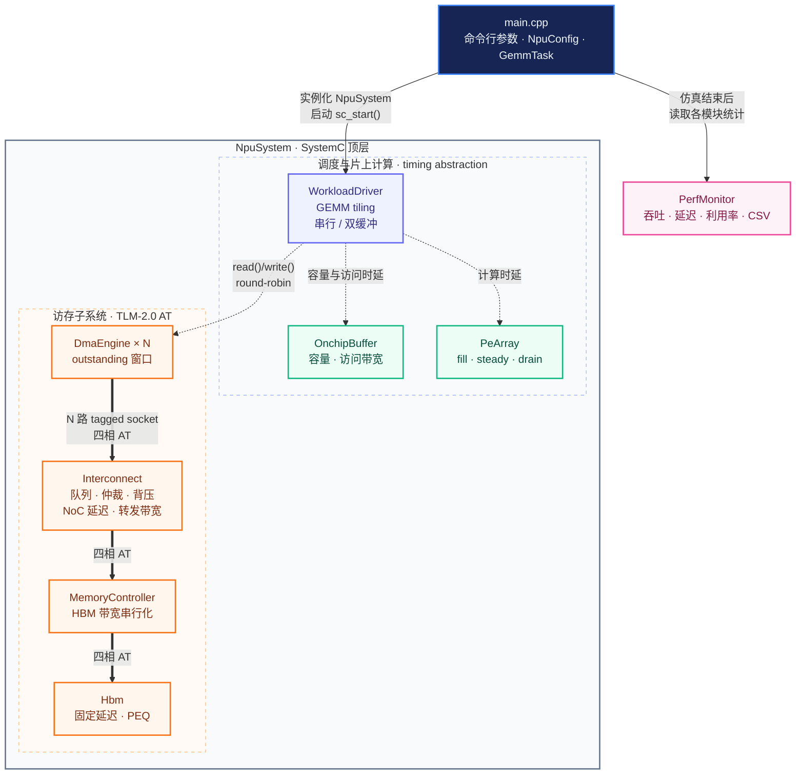
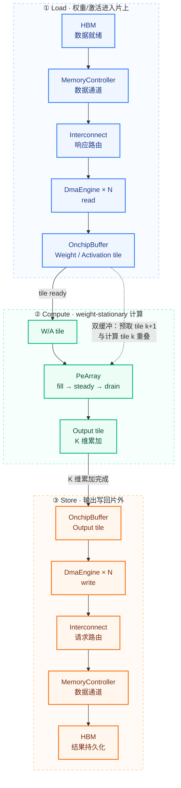

# npu-perf-model

> ## 🚧 Work in Progress
>
> A performance modeling framework for NPU architecture exploration.
>
> 当前进度：**MVP-1（LT 数据流）+ MVP-2（PE Array + double buffering）+ MVP-3（DMA↔Memory 四相 AT）+ MVP-4（Interconnect/Arbiter + contention）已完成**。

用 SystemC TLM2.0（DMA → Interconnect → MemoryController → HBM 全链路为四相 AT；其余模块为 timing abstraction）搭建的 weight-stationary 脉动阵列 NPU **性能模型**：输入 GEMM workload，输出吞吐 / 延迟 / 利用率预测，并支持 roofline 分析、配置敏感性研究与 validation。

## 技术栈

C++17 + SystemC 2.3.x + TLM2.0（Accellera 开源版）+ CMake

## 快速开始

```bash
# 1. 一键下载并编译 SystemC(含 TLM2.0)到 third_party/systemc(仅首次需要)
scripts/setup_systemc.sh            # 强制重编: scripts/setup_systemc.sh --force

# 2. 构建主工程与测试
cmake -S . -B build && cmake --build build -j

# 3. 跑 sanity 测试与仿真
ctest --test-dir build --output-on-failure
./build/npu_sim 512 512 512 16 256  # 用法: npu_sim [M K N] [array_n] [buffer_kb]
```

> SystemC 库与 `build/` 均不入库,靠上面脚本/CMake 现场生成。

## 抽象层次

cycle-approximate（近似周期级）：不做 cycle-accurate RTL，也不做纯解析。计算单元只建 timing，不做真实 MAC。

## 项目架构



图中粗实线表示 TLM-2.0 AT 四相 socket 链路（请求前向传递，响应沿 backward path 返回），虚线表示普通 C++ 函数调用。蓝紫色为调度模块，绿色为片上计算/存储，橙色为 AT 访存链路。

## 数据流



该图表示逻辑数据方向：Load 的 TLM 请求从 DMA 发往 HBM，数据就绪后沿响应路径返回 DMA；Store 则从片上 Buffer 经 DMA 写回 HBM。双缓冲模式下，tile `k+1` 的 Load 可与 tile `k` 的 Compute 在仿真时间中重叠。本项目是 timing-only 模型，图中“数据流”表示时序与流量记账，不搬运真实矩阵数据。

## 核心模块

- **PE Array**：脉动阵列，weight-stationary dataflow，建 fill/steady/drain 三阶段 timing。
- **Onchip Buffer**：容量 + 带宽双约束的片上 SRAM timing 模型。
- **DMA Engine**：AT initiator，四相握手 + outstanding 窗口，负责数据搬运。
- **Interconnect**：队列 + 仲裁 + 背压 + 转发带宽串行化，建模多 DMA 竞争 contention。
- **Memory Controller**：HBM 数据通道带宽串行化 bridge（插在 Interconnect 与 HBM 之间）。
- **HBM**：固定访问延迟 target（延迟可被多笔 outstanding 请求重叠隐藏）。
- **NpuSystem**：顶层模块，负责实例化与 socket 绑定。
- **Workload Driver**：GEMM tiling 与调度，支持 double buffering overlap。
- **Perf Monitor**：统计吞吐 / 利用率 / arithmetic intensity 并输出 CSV。

## 开发计划

| 阶段 | 内容 | 状态 |
|------|------|------|
| MVP-1 | common + Memory + Buffer + 单 DMA（LT 先跑通数据流） | ✅ 已完成 |
| MVP-2 | PE Array timing + double buffering overlap，输出吞吐/利用率 | ✅ 已完成 |
| MVP-3 | DMA↔Memory 路径升级为 AT（4 phases + PEQ） | ✅ 已完成 |
| MVP-4 | Interconnect/Arbiter + contention 实验 | ✅ 已完成 |
| MVP-5 | 解析模型交叉验证 + 敏感性扫描脚本 + 博客 | ⬜ 未开始 |

先用 LT 把功能跑通，再把关键路径换 AT。

**MVP-2 说明**：PE Array 建 fill/steady/drain 三阶段 timing；double buffering 提供两种实现——
解析重叠（单线程 `max(load, compute)`）与双 `SC_THREAD` 真并发（loader/compute + ping-pong 槽 +
`sc_event` 生产者-消费者同步，可跨 output tile 预取）。通过 `--serial` 关闭双缓冲作对照。

**MVP-4 说明**：访存路径升级为 N 个 DMA → Interconnect（队列+仲裁+背压）→ MemoryController
（带宽串行化）→ HBM（固定延迟）。新增命令行参数
`--dma N --arbiter fifo|rr|priority --noc-latency N --queue-depth N --interconnect-bw G`；
有效带宽 = min(interconnect_bw, hbm_bw)；队列满时背压（暂不回 END_REQ，腾槽后 promote）。

## 实验

1. **Roofline 定位**：改变 GEMM 形状（M/K/N）观察 compute-bound / memory-bound 分布。
2. **Buffer 敏感性**：扫描 buffer 容量，观察 HBM 流量与利用率变化。
3. **Double buffering**：对比预取开/关的总时间与利用率差异。
4. **Contention**：扫描并发 DMA channel 数，观察有效带宽与延迟退化。
5. **阵列规模扫描**：对比 8/16/32 阵列的峰值算力与利用率。

## 文档

- 完整开发文档（前置背景知识、模块代码骨架、timing 公式推导、博客大纲与实验设计）：[docs/design/NPU_Perf_Model_DevDoc.md](docs/design/NPU_Perf_Model_DevDoc.md)
- Phase-1 (MVP-1) 数据流程图（模块拓扑、tiling 循环、LT 时序、时间对账）：[docs/design/MVP1_dataflow.md](docs/design/MVP1_dataflow.md)
- Phase-3 (MVP-3) AT 数据框架图与四相协议原理图：[docs/design/MVP3_at_dataflow.md](docs/design/MVP3_at_dataflow.md)
- Phase-4 (MVP-4) 类图与 SystemC 连接关系：[docs/design/MVP4-Class-Diagram-SystemC-Connection.md](docs/design/MVP4-Class-Diagram-SystemC-Connection.md)
- Phase-4 (MVP-4) 详细设计规范（互连/仲裁/MC/背压/时序模型）：[docs/design/MVP4-Detailed-Design-Specification.md](docs/design/MVP4-Detailed-Design-Specification.md)
