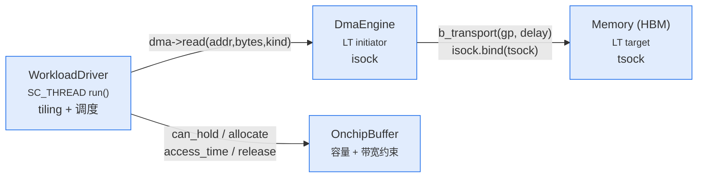
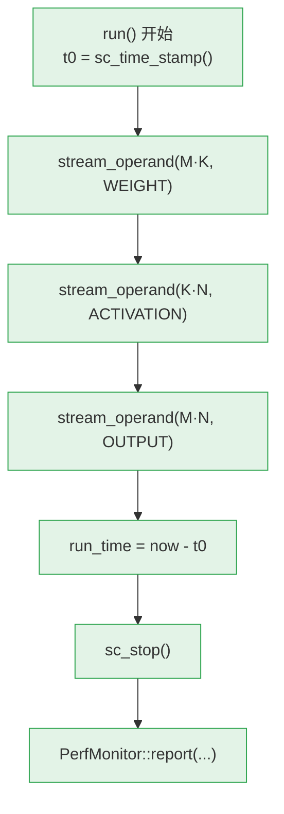
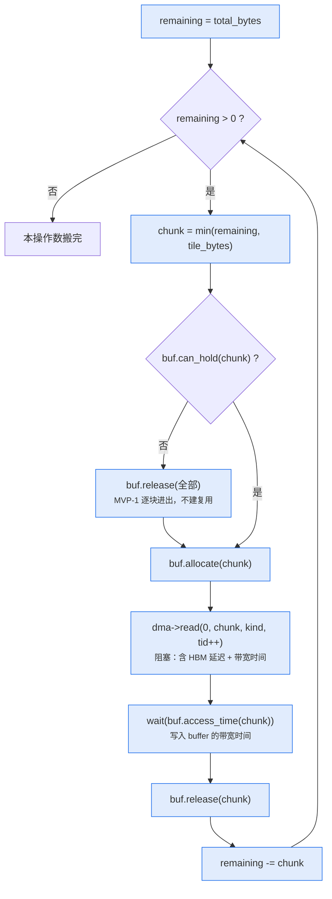
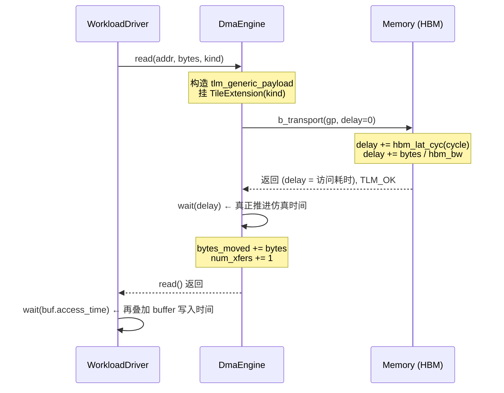
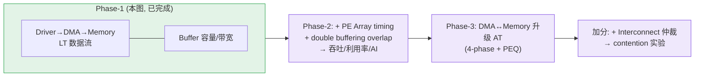

# Phase 1 (MVP-1) 数据流程图

> 对应实现：`common.h` / `memory.h` / `onchip_buffer.h` / `dma_engine.h` /
> `workload_driver.h` / `perf_monitor.h` / `main.cpp`。
> 抽象层次：**LT（loosely-timed）**，单 DMA 串行搬运，先把数据流跑通；
> Memory / DMA 升级为 AT 是 MVP-3 的事，PE Array 是 MVP-2 的事。

MVP-1 只建 **访存侧数据流**：把一个 GEMM(M×K×N) 需要的三个操作数
（权重 M·K、激活 K·N、输出 M·N 字节）按 tile 大小分块，经**单个 DMA**
从 HBM 读进片上 buffer，测出访存时间 `T_memory`。**不含 PE 计算**。

---

## 1. 模块拓扑与绑定

`main.cpp` 组装的拓扑（MVP-1 特意跳过 Interconnect，DMA 直连 Memory）：

- **实线 TLM 路径**：只有 `DMA.isock → Memory.tsock` 一条（`dma.isock.bind(mem.tsock)`）。
- **Buffer 不挂 socket**：它是纯 timing 辅助模块，由 Driver 直接函数调用查询占用与访问时间。
- **Driver 是唯一的 `SC_THREAD`**：整个仿真由它推进时间，跑完 `sc_stop()`。

---

## 2. 顶层调度：三个操作数依次流式搬运

`WorkloadDriver::run()` 的宏观流程：

> MVP-1 搬的是**理想最小字节 Bytes_min = (M·K + K·N + M·N)·data_bytes**
> （每个操作数只搬一遍，无复用惩罚）——这是访存下界的基准，复用建模留待后续。

---

## 3. 单个操作数内部：按 tile 分块的搬运循环

`stream_operand(total_bytes, kind)`，块大小 `tile_bytes = array_n² · data_bytes`：

---

## 4. 一次 DMA 搬运的 LT 时序（关键 timing 注入点）

`dma->read()` → `Memory::b_transport()` 的一次事务，时间怎么被"记账"：

**要点**：LT 里 `b_transport` 只是把"这次访问要花多久"累加进 `delay`，
是 `DmaEngine` 在 `wait(delay)` 时才把时间真正走掉。功能上不搬真实数据
（`data_ptr` 指向哑缓冲），这正是**性能模型**区别于功能模型之处——只关心"多快"。

---

## 5. 单块 tile 的时间构成（默认配置对账）

默认 `array_n=16, data_bytes=1 → tile=256B`；`hbm_bw=256GB/s, hbm_lat=100cyc@1GHz, buf_bw=64B/cyc`：

| 分量 | 公式 | 默认值 |
|------|------|--------|
| HBM 固定延迟 | `hbm_lat_cyc / freq` | 100 ns |
| HBM 传输 | `bytes / hbm_bw` = 256 / 256e9 | 1 ns |
| Buffer 写入 | `ceil(bytes / buf_bw_Bpc)` cyc = ceil(256/64)=4 | 4 ns |
| **单块合计** | | **105 ns** |

`sanity_tests` 里 16³ workload（每操作数正好 1 块、共 3 块串行）验证
`run_time == 3 × 105 = 315 ns`，与手算逐拍吻合。

> **MVP-1 暴露的洞察**：单 DMA + LT 串行，每块都被 100cyc 固定延迟卡死、无法隐藏，
> 512³ 实测有效带宽仅 ~2.4 GB/s(峰值 256)。这正是 **MVP-3 升级 AT + 多 outstanding
> 事务隐藏延迟**的动机。

---

## 6. 与后续阶段的关系

