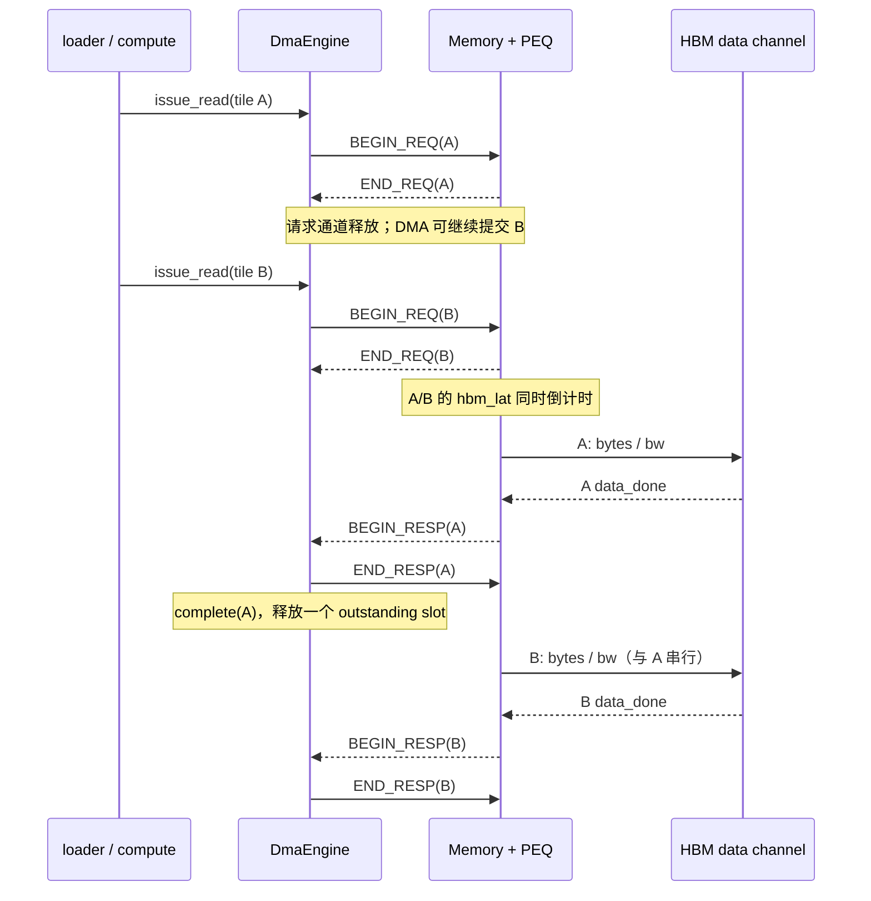

# MVP-3：AT 数据通路与原理图

> 对应实现：[DMA](../../include/dma_engine.h)、[Memory](../../include/memory.h)、
> [双缓冲调度](../../src/workload_driver.cpp)。本阶段将 MVP-1 的 LT `b_transport`
> 升级为 TLM-2.0 四相 AT，同时保留 PE Array 与 OnchipBuffer 的 timing abstraction。

## 数据框架图

```mermaid
flowchart LR
    subgraph D[WorkloadDriver：两个 SystemC 线程]
      L[loader<br/>预取 weight + activation]
      C[compute<br/>消费 tile、驱动 PE、写回 output]
      L <-->|ping-pong slot<br/>sc_event| C
    end
    B[OnchipBuffer<br/>容量 / SRAM 带宽]
    PE[PeArray<br/>fill / steady / drain]
    DMA[DmaEngine<br/>AT initiator<br/>最多 dma_outstanding 在途]
    MEM[Memory / HBM<br/>AT target + PEQ<br/>latency + bandwidth]

    L -->|issue_read(weight)| DMA
    L -->|issue_read(activation)| DMA
    DMA ==>|TLM nb_transport<br/>4-phase| MEM
    L -->|tile 到片上后<br/>SRAM 写入时间| B
    C -->|读取输入 / 累加输出| B
    C -->|pass_time + account_pass| PE
    C -->|write(output)| DMA

    classDef control fill:#1f6feb22,stroke:#1f6feb;
    classDef storage fill:#2da44e22,stroke:#2da44e;
    classDef compute fill:#bf870022,stroke:#bf8700;
    class L,C,DMA control;
    class B,MEM storage;
    class PE compute;
```

图中只有 `DMA ↔ Memory` 是 TLM socket 协议路径；Buffer 与 PE 是由 Driver 调用
的纯 timing 模块。双缓冲让 loader 和 compute 并发，AT 进一步让同一 tile 的
weight/activation 请求并发，从而隐藏 HBM 固定延迟。

## 四相 AT 原理图



## 时间与资源模型

对于在时刻 `arrival` 到达、大小为 `bytes` 的请求：

```text
ready_for_data = arrival + hbm_lat_cyc / CLK_FREQ_HZ
data_start     = max(ready_for_data, next_data_free)
data_done      = data_start + bytes / hbm_bw_Bps
next_data_free = data_done
```

- `ready_for_data` 前是可并行重叠的固定延迟。
- `next_data_free` 是唯一的 HBM 数据通道，确保并发请求的总传输量不超过峰值带宽。
- `END_REQ` 在 `arrival` 发出，允许 DMA 的请求窗口继续填充；请求额度在 `END_RESP`
  后回收，因此同时也保护 payload 和扩展对象的生命周期。

## 边界与当前简化

- 不传输真实矩阵数据，`data_ptr` 是仅满足 TLM 约定的哑指针。
- `Memory` 没有 bank、读写差异、QoS 或地址映射；这些属于 MVP-4 Interconnect /
  contention 与后续细化的范围。
- 当前 loader 每次并发发起两个读取，默认 `dma_outstanding=4` 仍为未来多个 DMA
  channel 或更深预取留出了窗口。
