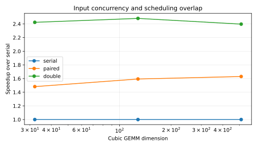
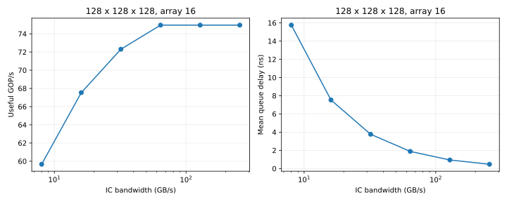
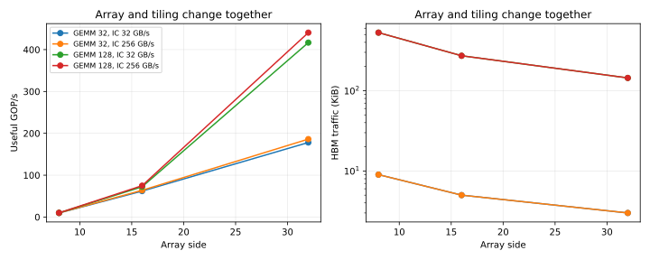
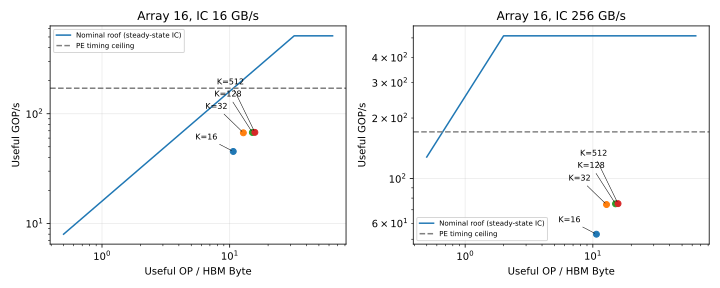
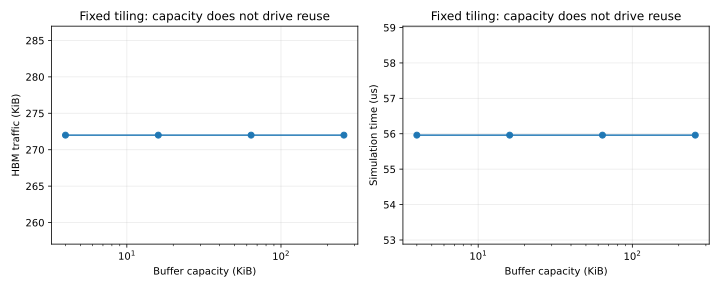

# MVP-5 实验报告：解析验证与架构参数分析

## 1. 范围与复现

本轮完成 62 个固定用例，包括独立计数/时间验证与五组实验。结果验证的是当前简化模型的实现与假设一致性，不是对真实 NPU 精度的校准。

- [实验输入与运行说明](../../experiments/mvp5/README.md)
- [完整数据 CSV](mvp5_baseline/results.csv)、[JSON](mvp5_baseline/results.json)
- [逐项验证表](mvp5_baseline/validation.csv)、[来源与运行命令](mvp5_baseline/manifest.json)
- [设计方案](../design/MVP5_Validation_and_Experiments.md)

SystemC 2.3.4，1 GHz，时间分辨率 1 ps；每个元素 1 Byte，1 MAC = 2 OP。HBM 带宽固定 256 GB/s、延迟 100 cycle，Buffer 带宽 64 Byte/cycle。除扫描量外，DMA=1、outstanding=4、FIFO、队列深度=16、NoC 延迟=0。每个用例的完整参数以 JSON 为准。

运行使用尚未提交的工作区实现；manifest 记录基线 commit、dirty 状态、源码哈希和二进制哈希。仅检出其中的基线 commit 无法复现本轮新增功能，需要当前这组源码。原始日志保存在本机 `results/mvp5/final-20260909/raw/`。

## 2. 独立解析验证

独立 Python 参考只读取配置与 workload，不读取仿真计数作为期望，也不调用 C++ 生产函数。整数请求数、流量、PE passes、MAC、有效/执行 OP 精确核对。受控串行和 paired 用例进一步核对总时间 ticks。

| 手算用例（阵列 16） | 请求数 | 流量 | 时间期望 | 实测 |
|---|---:|---:|---:|---:|
| 16×16×16 serial | 3 | 768 B | 363 ns | 363 ns |
| 16×16×16 paired | 3 | 768 B | 262 ns | 262 ns |
| 16×16×16 double | 3 | 768 B | 单 slice 与 paired 相同 | 262 ns |
| 16×32×16 serial | 5 | 1280 B | 621 ns | 621 ns |
| 16×32×16 paired | 5 | 1280 B | 419 ns | 419 ns |

paired 单 slice 的输入加载：第一笔在 101 ns 完成，第一次 Buffer 写入结束于 105 ns，此时第二笔已完成；第二次 Buffer 写入结束于 109 ns。随后计算 48 ns、输出访问与写回 105 ns，总计 262 ns。两笔访存与第一次 Buffer 等待部分重叠，不能逐笔累加全部延迟。

计数验证还覆盖 1³、17³、31×33×65、不同阵列规模及 NoC 延迟。17³ 在阵列 16 上执行 65,536 OP，而有效运算仅 9,826 OP，展示了尾块补齐对指标的影响。批量验证检查 PE/HBM 时间下界、调度间流量守恒、Buffer 基线不变及代表用例重复确定性。

62 次运行的 836 项校验全部通过，计数和受控精确时间一致；完整并发时间只做守恒、下界与确定性验证，不声称已有完整独立并发时序 oracle。现有 sanity_tests 和新增 mvp5_validation 均通过。

## 3. E1：分离输入并发与调度重叠

serial 顺序读取两个输入；paired 同时提交两个输入但不预取下一 slice；double 在 paired 的输入并发基础上启用 loader/compute 重叠。

| GEMM | serial (us) | paired (us) | double (us) | 输入并发收益 serial/paired | 后续重叠收益 paired/double | 总收益 serial/double |
|---|---:|---:|---:|---:|---:|---:|
| 32³ | 2.484 | 1.676 | 1.025 | 1.482× | 1.635× | 2.423× |
| 128³ | 138.816 | 87.104 | 55.961 | 1.594× | 1.557× | 2.481× |
| 512³ | 8561.664 | 5252.096 | 3571.865 | 1.630× | 1.470× | 2.397× |

三种模式的请求数和流量相同，因此收益来自调度，不是减少搬运。在 128³ 上，单独输入并发就带来约 1.59 倍收益，进一步调度重叠带来约 1.56 倍，总收益约 2.48 倍。不能把 serial/double 全部归因于计算与访存重叠，也不能将两个收益百分比简单相加。

## 4. E2：互连带宽平台期

固定 128³、阵列 16、double，扫描 IC 带宽。

| IC (GB/s) | 总时间 (us) | 吞吐 (GOP/s) | 平均队列等待 (ns) |
|---:|---:|---:|---:|
| 8 | 70.297 | 59.665 | 15.754 |
| 16 | 62.105 | 67.536 | 7.529 |
| 32 | 58.009 | 72.304 | 3.765 |
| 64 | 55.961 | 74.950 | 1.882 |
| 128 | 55.961 | 74.950 | 0.941 |
| 256 | 55.961 | 74.950 | 0.471 |

IC 从 8 提高到 64 GB/s，吞吐由 59.665 增至 74.950 GOP/s；继续提高到 128/256 GB/s，总时间保持不变，尽管平均队列等待继续下降。

当前请求为 256 B，IC=64 GB/s 时两笔请求发出间隔为 4 ns，恰好等于一次 Buffer 访问时间。孤立输入对中，第二笔响应的这部分间隔已能被第一次 Buffer 等待覆盖；继续缩短间隔不必然缩短 loader 的完成时间。100 ns 固定 HBM 延迟和每轮有限请求供应仍然存在。

这与实测平台期一致，但尚未逐周期分解整个并发任务的关键路径。74.950 GOP/s 也明显低于阵列的 170.667 GOP/s 计算天花板，故不能将平台期解释为“PE 已满”。

## 5. E3：阵列扩容同时改变分块和流量

固定 128³、IC=256 GB/s：

| 阵列 | HBM 流量 (B) | 总时间 (us) | 吞吐 (GOP/s) |
|---|---:|---:|---:|
| 8×8 | 540672 | 418.941 | 10.012 |
| 16×16 | 278528 | 55.961 | 74.950 |
| 32×32 | 147456 | 9.520 | 440.578 |

阵列边长从 8 到 32，PE 数量变为 16 倍，而吞吐约变为 44 倍。这不是同等流量下仅增加计算单元的收益：tile 同时增大，输入重复加载次数和 DMA 请求数下降，单笔请求变大，使固定延迟更易摊薄，HBM 流量也从 540,672 B 降至 147,456 B。

因此本实验支持“阵列与分块联合配置显著影响性能”，不能作为“纯 PE 扩容获得超线性加速”的证据。

## 6. E4：Roofline 与实现天花板

固定阵列 16，标称峰值为 512 GOP/s；当前每 pass 执行 2a³ OP、耗时 3a cycle，故计算阶段的执行吞吐天花板为 170.667 GOP/s。图中同时显示两者。

M=N=128、K 从 16 增至 512 时，实际 AI 从约 10.67 增至 15.75 OP/Byte，增长逐渐饱和。这由固定 tile 流量公式决定，不是任意矩阵规模都能横跨很宽的运算强度范围。实测点远低于标称屋顶，说明只画最终 Roofline 不足以解释有限并发和调度开销。

IC 的线是稳态参照：当前模型限制请求发出间隔，首笔立即转发，不应把有限批次的 Q/B_ic 当成无条件严格时间下界。HBM 带宽由 MC 在响应阶段串行化，Q/B_hbm 可用作本轮时间下界。

## 7. E5：Buffer 容量行为基线

Buffer=4/16/64/256 KB 时，128³ 的 HBM 流量都为 278,528 B，总时间均为 55.961 us。当前实现固定 tile、固定两个槽，没有基于容量增加跨 tile 驻留复用；容量占位检查也不完整。因此平坦曲线是当前实现行为的验证，不是现实 SRAM 容量无收益的结论。

## 8. 适用边界和后续方向

- 本轮独立解析验证通过不代表真实硬件预测精度经过校准。
- 模型用同一元素宽度表示输入与输出，未单独建立真实累加器精度和流量。
- SRAM 访问是调用方等待，不含完整共享端口竞争与容量约束。
- 固定 3a 的 PE pass 时序不是每个真实脉动阵列的精确周期公式。
- 公平性、HBM bank 行为和大窗口持续流量没有在本轮验证。
- 首版仅有有限并发约束验证；下一步可增加事件轨迹及等待原因统计，再研究请求供应或容量驱动的复用。

现有证据足以说明：输入并发和预取重叠都能带来收益；增加 IC 带宽会遭遇当前加载时序的平台期；阵列扩容收益必须与 tiling/流量变化一起解释。
