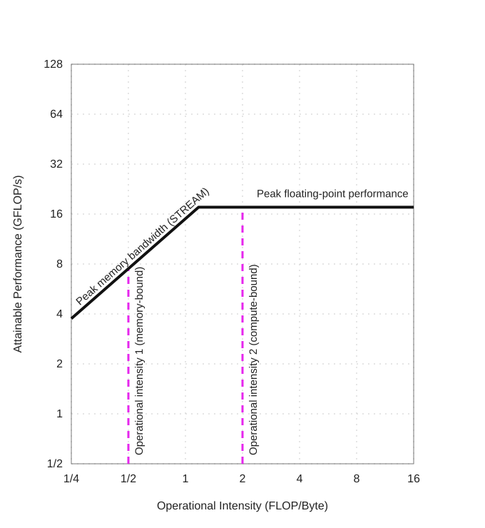

# Roofline 模型核心学习笔记

> 阅读版本：[仓库内 PDF](../references/Roofline_Insightful_Visual_Performance_Model_2009.pdf)。虽然文件名包含 `2009`，PDF 首页标注的是 2008 年 10 月 17 日的 Berkeley 技术报告 UCB/EECS-2008-134。下文章节号指论文正文及附录；“NPU 延伸”是结合本项目的推导，不是论文中的原始实验结论。

## 1. Roofline 模型解决什么问题

Roofline 是一个性能上界模型，用来判断某个计算内核（kernel）在一台计算机上主要受到哪种资源限制：

- **计算受限（compute-bound）**：处理器的浮点计算能力成为瓶颈。
- **内存受限（memory-bound）**：片外内存向处理器提供数据的速度成为瓶颈。

它给出的不是程序一定能够达到的实际性能，而是程序在给定硬件和运算强度下的**性能上限**。

核心公式为：

$$
P_{\text{attainable}}
=
\min\left(P_{\text{peak}},\ B_{\text{memory}}\times I\right)
$$

其中：

- $P_{\text{attainable}}$：可达到的性能上限，单位通常为 GFLOP/s。
- $P_{\text{peak}}$：处理器峰值浮点性能。
- $B_{\text{memory}}$：可持续峰值内存带宽，单位通常为 GB/s。
- $I$：Operational Intensity（运算强度），单位为 FLOP/Byte。


### 1.1 阿姆达尔定律：局部加速能带来多少整体收益

论文第 2 节把阿姆达尔定律（Amdahl’s Law）作为上界与瓶颈分析的经典例子。它回答的问题是：

> 如果只加速程序的一部分，那么整个程序最多能加速多少？

公式为：

$$
\text{Speedup}=\frac{1}{(1-p)+\frac{p}{s}}
$$

其中：

- $p$：被加速部分在**优化前总执行时间**中所占的比例，$0\leq p\leq1$。它不是代码行数、指令条数或运算次数的比例。
- $s$：该部分自身的加速倍数。例如 $s=4$ 表示这部分耗时降为原来的四分之一。
- $1-p$：其余未被加速部分在原始执行时间中的比例。
- $\text{Speedup}$：整个程序的加速比，即优化前总时间除以优化后总时间。

图示中常用大写 $P$ 和 $S$；这里使用小写 $p$ 和 $s$，避免与 Roofline 中表示性能的 $P$ 混淆。

### 1.2 从执行时间推导公式

设优化前总时间为 $T_0$，则未被加速部分耗时为 $(1-p)T_0$，被加速部分耗时为 $pT_0$。如果优化仅将后者加速 $s$ 倍，其他部分不变，也没有新增开销，那么：

$$
T_1=(1-p)T_0+\frac{pT_0}{s}
$$

因此：

$$
\text{Speedup}=\frac{T_0}{T_1}
=\frac{1}{(1-p)+p/s}
$$

例如，程序原来执行 100 ms，其中 80 ms 可以优化，其余 20 ms 不变。将可优化部分加速 4 倍后：

$$
T_1=20+\frac{80}{4}=40\ \text{ms}
$$

$$
\text{Speedup}=\frac{100}{40}=2.5
$$

所以，**局部加速 4 倍，整体只加速 2.5 倍**。对于同一个 $p=0.8$ 的程序：

| 局部加速倍数 $s$ | 优化后总时间 | 整体加速比 |
|---:|---:|---:|
| 1 | 100 ms | 1 倍 |
| 2 | 60 ms | 约 1.67 倍 |
| 4 | 40 ms | 2.5 倍 |
| 10 | 28 ms | 约 3.57 倍 |
| 趋于无穷大 | 趋于 20 ms | 趋于 5 倍 |

当被优化部分的耗时趋于零、且 $p<1$ 时：

$$
\text{Speedup}_{\max}=\lim_{s\to\infty}\text{Speedup}
=\frac{1}{1-p}
$$

其余 20% 的时间限制了整体收益。优化之后，这部分在新总时间中的占比会增大，因而后续可能需要转向优化它。

### 1.3 并行计算中的常见形式

如果 $p$ 表示单处理器执行时间中可理想并行的比例，使用 $N$ 个处理器让这部分获得 $N$ 倍加速，则：

$$
\text{Speedup}(N)=\frac{1}{(1-p)+p/N}
$$

这是固定问题规模、理想负载均衡且忽略通信和同步等额外开销的形式。实际增加处理器数量不一定带来相同比例的局部加速；通用公式中的 $s$ 应是该部分实际达到或有依据预测的加速倍数。

### 1.4 与 Roofline 的关系及 NPU 延伸

| 模型 | 主要回答的问题 |
|---|---|
| 阿姆达尔定律 | 已知某部分占用的时间和局部加速倍数，整体能加速多少 |
| Roofline | 给定硬件能力和运算强度，内核的性能上限是多少，受何种资源限制 |

可以先通过 Roofline 判断局部计算是否有提升空间，再用阿姆达尔定律估计局部改善对整个任务的影响。两者都用于分析上界和瓶颈，但不能直接把峰值算力的增长倍数当成实际局部加速倍数。

**NPU 延伸：** 假设串行执行时计算占 80 ms，搬运及其他阶段共占 20 ms，而且各阶段不重叠。如果 PE 计算部分实际加速 4 倍，同时搬运流量及其耗时不变，就可以使用上述例子，得到整体 2.5 倍的加速。

如果启用了双缓冲，计算与搬运可能重叠，此时不能把各模块的忙碌时间直接相加来计算 $p$：它们可能重复覆盖同一段墙钟时间。理想稳态下，一个 tile 的服务间隔可近似为：

$$
T_{\text{tile}}\approx\max(T_{\text{compute}},T_{\text{transfer}})
$$

其中 $T_{\text{transfer}}$ 应覆盖相关搬运路径的限制；完整任务还要考虑流水线启动、排空、依赖与资源竞争。对这种情况，应依据实际调度和关键路径估计整体收益，而不是机械套用串行阶段相加的公式。

---

## 2. Kernel、Working Set、Cache 和 Memory

### 2.1 Kernel

Kernel 在这里不是操作系统内核，而是程序中承担核心计算的一段代码，例如矩阵乘法、卷积或向量运算。

### 2.2 Working Set

Working set（工作集）是计算过程中需要访问的那部分数据。

原文：

> The working sets of the kernels we consider here do not fit fully in on-chip caches.

含义是：这些计算内核所需的数据不能全部装入片上 Cache，因此计算过程中必须持续访问 Cache 后面的主存系统。

### 2.3 Cache 与片外内存

- **on-chip caches**：片上缓存，通常包括 L1、L2，以及很多处理器中的 L3 Cache。
- **off-chip memory / DRAM**：片外主存，例如 DDR、GDDR 或 HBM。
- **memory system behind the caches**：位于 Cache 层次结构之后的主存系统，主要包括内存控制器、总线和 DRAM。

数据访问路径可以理解为：

```text
计算核心 → L1 Cache → L2 Cache → L3 Cache → 内存控制器 → DRAM
```

Cache 会过滤掉一部分内存访问：如果数据命中 Cache，就不需要访问 DRAM；只有未命中的访问才会形成 DRAM traffic。因此，经典 Roofline 中的 Operational Intensity 通常根据真正到达 DRAM 的字节数计算。

---

## 3. Roofline 图的两个坐标轴

### 3.1 X 轴：Operational Intensity

$$
I=\frac{\text{浮点运算次数}}{\text{访问 DRAM 的字节数}}
$$

单位是：

$$
\text{FLOP/Byte}
$$

它描述每从 DRAM 传输 1 Byte 数据，内核能够做多少次浮点运算。

- 运算强度低：数据利用率低，更容易受内存带宽限制。
- 运算强度高：同一份数据被重复计算或复用得更多，更容易接近计算峰值。

### 3.2 Y 轴：浮点性能

$$
P=\frac{\text{浮点运算次数}}{\text{运行时间}}
$$

单位通常是 GFLOP/s，即每秒十亿次浮点运算。

Roofline 屋顶表示理论或测得的性能上限；程序实际运行得到的性能点通常位于屋顶下方。

### 3.3 双对数坐标

经典 Roofline 使用 log-log scale（双对数坐标）。这使跨越多个数量级的数据能够清晰地显示，也使内存带宽线呈现为斜率为 1 的直线。

---

## 4. 水平线：峰值浮点计算性能

水平线表示整台计算机的峰值浮点计算性能：

$$
P_{\text{peak}}
=
\text{CPU 数量}
\times
\text{每颗 CPU 的核心数}
\times
\text{主频}
\times
\text{每核心每周期 FLOP 数}
$$

峰值性能不随运算强度增加而无限提高，因此在图中是一条水平线。程序性能不可能超过这一硬件计算上限。

### 4.1 双 Socket 示例

论文使用 2.2 GHz AMD Opteron X2 2214 双路系统：

- 2 个 Socket，即安装 2 颗物理 CPU。
- 每颗 CPU 有 2 个核心。
- 整机共有 4 个核心。
- 每核心主频为 2.2 GHz。
- 每核心每周期最多完成 2 次双精度浮点运算。

所以：

$$
P_{\text{peak}}
=2\times2\times2.2\times2
=17.6\ \text{GFLOP/s}
$$

### 4.2 为什么是每周期 2 次双精度运算

这不是“前半个周期算一次、后半个周期再算一次”，而是 SIMD 并行计算。

一个双精度浮点数占 64 bit，一条 128 bit SSE 向量指令可以同时处理两个双精度数：

```text
[a0, a1] + [b0, b1] → [a0+b0, a1+b1]
```

这条指令同时完成两个加法，因此计为 2 FLOP。如果处理器每周期能够启动一条这样的指令，吞吐率就是 2 FLOP/周期。

还要区分：

- **Latency（延迟）**：一条指令从开始到产生结果可能需要多个周期。
- **Throughput（吞吐率）**：流水线填满后，每周期可以启动或完成多少组计算。

现代处理器还需要考虑 AVX/AVX-512 向量宽度、每周期指令数以及 FMA。一条 FMA 对每个元素执行一次乘法和一次加法，通常计为 2 FLOP。

---

## 5. 斜线：峰值内存带宽所支撑的性能

对于给定运算强度，内存系统能够支撑的最大浮点性能为：

$$
P_{\text{memory}}=B_{\text{memory}}\times I
$$

从单位也可以验证：

$$
\frac{\text{Byte}}{\text{s}}
\times
\frac{\text{FLOP}}{\text{Byte}}
=
\frac{\text{FLOP}}{\text{s}}
$$

反过来：

$$
B_{\text{memory}}
=
\frac{P}{I}
=
\frac{\text{FLOP/s}}{\text{FLOP/Byte}}
=
\text{Byte/s}
$$

### 5.1 数值示例

假设可持续峰值内存带宽是：

$$
B_{\text{memory}}=15\ \text{GB/s}
$$

则：

| 运算强度 $I$ | 内存能够支撑的性能 $B\times I$ |
|---:|---:|
| 0.25 FLOP/Byte | 3.75 GFLOP/s |
| 0.5 FLOP/Byte | 7.5 GFLOP/s |
| 1 FLOP/Byte | 15 GFLOP/s |
| 2 FLOP/Byte | 30 GFLOP/s |

运算强度增加一倍，内存能够支撑的浮点性能也增加一倍，因此形成一条向右上方延伸的斜线。

在双对数坐标中：

$$
\log P=\log B_{\text{memory}}+\log I
$$

其斜率为 1，在横纵轴显示比例一致时看起来就是一条 45-degree angle（45 度角）的直线。45 度是双对数图中的视觉结果；在普通线性坐标中，直线的斜率实际是 $B_{\text{memory}}$，不一定呈 45 度。

---

## 6. 两条线为什么组成“屋顶”

性能同时受到两个上限约束：

1. 不能超过处理器的峰值计算性能。
2. 不能超过内存带宽在当前运算强度下能够支撑的性能。

因此必须取两者的较小值：

$$
P_{\text{attainable}}
=
\min(P_{\text{peak}},B_{\text{memory}}\times I)
$$

- 左侧斜线部分：内存带宽上限更低，因此是 memory-bound。
- 右侧水平部分：计算峰值上限更低，因此是 compute-bound。

水平线与斜线组合后形似屋顶，所以这个模型被称为 Roofline。



*图：根据论文 Figure 1(a) 重绘的 AMD Opteron X2 Roofline 模型（双对数坐标，峰值算力 17.6 GFLOP/s，内存带宽 15 GB/s）。来源：Samuel Williams、Andrew Waterman、David Patterson，[Roofline: An Insightful Visual Performance Model for Floating-Point Programs and Multicore Architectures](../references/Roofline_Insightful_Visual_Performance_Model_2009.pdf)。*

图中的黑色斜线表示内存带宽所支撑的性能上限，水平线表示峰值浮点计算性能。两条紫色虚线展示了不同运算强度的内核：

- 左侧虚线（约 0.5 FLOP/Byte）先碰到斜线，因此属于 memory-bound。
- 右侧虚线（约 2 FLOP/Byte）先碰到水平线，因此属于 compute-bound。

虚线与屋顶的交点表示对应内核的性能上限；实际性能还需测量，通常位于交点下方。

### 6.1 Ridge Point：屋脊点

两条线的交点称为 ridge point：

$$
I_{\text{ridge}}
=
\frac{P_{\text{peak}}}{B_{\text{memory}}}
$$

对于论文中的系统：

$$
I_{\text{ridge}}
=
\frac{17.6}{15}
\approx1.17\ \text{FLOP/Byte}
$$

- $I<1.17$：理论上主要受内存带宽限制。
- $I>1.17$：理论上主要受计算峰值限制。

交点不是要求所有程序都必须达到的“最佳位置”，而是硬件瓶颈发生转换的位置。

---

## 7. 如何在图中定位一个 Kernel

对于一个给定的 kernel，可以根据它的 Operational Intensity 在 X 轴上确定位置，然后从该位置向上画一条竖线。

例如：

$$
I=1\ \text{FLOP/Byte}
$$

那么内核的 X 坐标固定为 1。它的实际性能可能是 5、10 或 14 GFLOP/s，所以性能点会位于 $X=1$ 的竖线上的某个位置。

原文中的：

> The performance of the kernel must lie somewhere along that line.

意思是：

> 该内核的性能点一定处于这条竖线上的某个位置。

这里不是说性能会沿着竖线移动，而是说运算强度已经确定了 X 坐标，但实际性能 Y 坐标还需要测量。竖线与 Roofline 的交点给出性能上限，实际性能点通常位于交点下方。

---

## 8. “柱子碰到屋顶”的比喻

可以把一个 kernel 的运算强度想象成从 X 轴向上延伸的柱子：

- 柱子碰到屋顶的倾斜部分：程序是 memory-bound。
- 柱子碰到屋顶的水平部分：程序是 compute-bound。

这个比喻强调的是：内核的 X 坐标由运算强度确定，向上寻找可达到的最高 Y 值时，最先碰到的屋顶部分决定了主要性能瓶颈。

---

## 9. 理论峰值、可达到上限与实际性能

三个概念需要区分：

| 概念 | 含义 | 获得方式 |
|---|---|---|
| 理论峰值性能 | 硬件在理想条件下的绝对计算上限 | 根据硬件规格计算 |
| Roofline 可达到上限 | 给定运算强度后，由计算峰值和内存带宽共同确定的上界 | 使用 $\min(P_{\text{peak}},B\times I)$ 计算 |
| 实际性能 | 程序真正运行得到的性能 | 根据 FLOP 数和运行时间测量 |

实际性能通常低于 Roofline 上限，因为还会受到以下因素影响：

- Cache miss 和访存延迟；
- 指令依赖和流水线停顿；
- SIMD 利用不足；
- 分支预测错误；
- 并行负载不均衡；
- 软件调度、循环结构和编译优化不足。

峰值内存带宽也应尽量使用 STREAM 或优化微基准测得的**可持续 DRAM 带宽**，而不是只采用 DRAM 引脚的理论带宽。

---

## 10. 重要英文术语

| 英文 | 中文含义 |
|---|---|
| kernel | 计算内核、核心计算代码 |
| working set | 工作集 |
| on-chip cache | 片上缓存 |
| off-chip memory | 片外内存 |
| memory system behind the caches | Cache 后面的主存系统 |
| operational intensity | 运算强度 |
| peak floating-point performance | 峰值浮点性能 |
| attainable performance | 可达到的性能上限 |
| peak memory bandwidth | 峰值内存带宽 |
| sustainable DRAM bandwidth | 可持续 DRAM 带宽 |
| horizontal line | 水平线 |
| diagonal / slanted line | 斜线、倾斜线 |
| angle | 角、角度 |
| a 45-degree angle | 一个 45 度角 |
| compute-bound | 计算受限 |
| memory-bound | 内存受限 |
| upper bound | 上界、上限 |
| dual-socket system | 双路系统、双 CPU 插槽系统 |
| somewhere along that line | 位于那条线上的某个位置 |

语法补充：

- **a 45-degree angle**：一个 45 度角。`45-degree` 是复合形容词，因此 degree 使用单数。
- **The angle is 45 degrees.**：这个角是 45 度。此时 degrees 使用复数。

---

## 11. Ceilings：屋顶下方还有多层天花板

对应论文第 4 节、Figure 2。

基本 Roofline 给出最终上限，但实际性能远低于上限时，还需要判断哪个因素限制了性能。论文因此在屋顶下加入 **ceiling（性能天花板）**：没有满足相应优化条件时，性能受限于这一层更低的上界。

### 11.1 计算天花板与带宽天花板

| 类型 | 论文中的限制因素 | 图中的表现 |
|---|---|---|
| 计算 | 指令级并行度不足、未充分使用 SIMD | 更低的水平线 |
| 计算 | 加法和乘法比例不平衡，不能充分利用运算单元 | 更低的水平线 |
| 带宽 | 连续访问、内存亲和性、软件预取等优化条件未满足 | 更低的斜线 |

论文中的 Opteron X2 示例给出了 2.2、8.8 GFLOP/s 等计算天花板，以及 2.7、4.8、11 GB/s 等带宽天花板；最高屋顶仍为 17.6 GFLOP/s 和 15 GB/s。这些数值对应那台机器和论文的实验条件，不能直接移植到其他硬件。

若某组优化条件下，计算上限为 $P_c$、可持续带宽为 $B_c$，可用以下形式理解相应上界：

$$
P\leq\min(P_c, B_c I)
$$

给定运算强度后，既要看水平天花板，也要看斜线天花板。即使一个内核按最终屋顶属于 memory-bound，它也可能因为尚未发挥计算能力，先被更低的计算天花板限制。

### 11.2 提高指令级并行度，并使用 SIMD

论文方法：**Improve instruction level parallelism (ILP) and apply SIMD.** 对应第 4 节，附录 A.1.3 进一步解释了并行度的计算天花板。以下代码是说明性示例。

**指令级并行度（ILP）** 指让多条相互独立的指令重叠执行。如果每一步都依赖前一步的结果，即使运算单元支持流水线，也可能无法每周期启动新运算。

例如，求和循环具有连续的数据依赖：

```cpp
for (int i = 0; i < N; ++i)
    sum += A[i];  // 下一次更新依赖这一次 sum 的结果
```

循环展开并使用多个独立的部分和，可以提供更多独立运算：

```cpp
double s0 = 0, s1 = 0, s2 = 0, s3 = 0;
int i = 0;
for (; i + 3 < N; i += 4) {
    s0 += A[i];
    s1 += A[i + 1];
    s2 += A[i + 2];
    s3 += A[i + 3];
}
double sum = (s0 + s1) + (s2 + s3);
for (; i < N; ++i)
    sum += A[i];
```

四条累加链之间相互独立，处理器可以交错执行，以隐藏加法流水线的延迟。仅仅复制循环体、仍然更新同一个累加变量，不一定能解除依赖。浮点求和顺序改变可能带来舍入差异，实际使用时需符合程序的数值要求。

**SIMD（单指令多数据）** 则让一条指令处理多个元素，例如向量加法：

```text
[a0, a1] + [b0, b1] → [a0+b0, a1+b1]
```

ILP 解决“能否同时安排多条独立指令”，SIMD 解决“一条指令处理多少个元素”。两者可以结合，但向量宽度之外，还要考虑硬件每周期能启动多少条向量指令。

**Roofline 含义：** 缺少这些并行性时，程序会受到更低的计算水平天花板限制；数据及时到达也无法自动填满运算流水线。

### 11.3 平衡浮点运算组合

论文方法：**Balance floating-point operation mix.** 对应第 4 节，附录 A.1.4 进一步讨论指令组成。

这里有两个层次：

1. **全部指令中要有足够比例的浮点运算。** 地址计算、循环控制、分支等也会占用取指和发射资源，可能使浮点执行单元得不到足够的计算任务。
2. **浮点加法和乘法的组合要匹配硬件能力。** 峰值性能常按加法、乘法单元同时工作，或者持续执行融合乘加（FMA）计算。

假设某个处理器的加法和乘法单元相互独立，每个单元每周期都能启动一次标量运算：

| 执行情况 | 加法单元 | 乘法单元 | 稳态吞吐上限 |
|---|---|---|---|
| 只有加法 | 工作 | 空闲 | 1 FLOP/周期 |
| 有足够的独立加法和乘法 | 工作 | 工作 | 2 FLOP/周期 |

所以，加法单元一直忙并不意味着整个处理器达到了峰值。原文强调同时执行的加法与乘法数量匹配；仅有总数量相等，但受依赖限制只能串行执行，也不够。

FMA 执行 $a\times b+c$，包含一次乘法和一次加法，通常计为 2 FLOP。矩阵乘法中的 `C[i][j] += A[i][k] * B[k][j]` 天然有乘加结构，而纯求和 `sum += A[i]` 没有对应的有效乘法工作。

**Roofline 含义：** 如果程序不能利用峰值计算所假设的运算组合，就会受到更低的计算天花板限制。最佳比例取决于硬件，并非所有处理器都要求 1:1；不能为了凑比例而添加无用运算。GEMM 天然包含乘加，也仍需足够的并行性和数据供给才能发挥峰值能力。

### 11.4 调整循环结构，实现单位步长访问

论文方法：**Restructure loops for unit stride accesses.** 对应第 4 节。

**Unit stride（单位步长）** 指相邻两次访问在内存中相差一个元素，例如依次访问 `A[0]、A[1]、A[2]`。如果元素是 8 Byte，地址每次增加 8 Byte，而不是增加 1 Byte。

对于按行连续存储的二维数组 `A[ROWS][COLS]`，以下访问方式的内层循环跨行跳跃，相邻访问相差 `COLS` 个元素：

```cpp
for (int j = 0; j < COLS; ++j)
    for (int i = 0; i < ROWS; ++i)
        use(A[i][j]);
```

若不存在阻止交换循环的数据依赖或顺序要求，可以改为按行访问：

```cpp
for (int i = 0; i < ROWS; ++i)
    for (int j = 0; j < COLS; ++j)
        use(A[i][j]);
```

连续访问有利于利用已经取入的缓存行，也更容易让硬件预取器识别后续访问地址，提前准备数据。实际收益取决于工作集、布局和硬件；列优先存储时，应相应调整循环顺序。

**Roofline 含义：** 论文强调这种方式可以提高实际可持续带宽，突破较低的带宽天花板。如果它还减少了重复 DRAM 传输，运算强度也可能提高；应通过流量测量区分这两种作用。

### 11.5 确保内存亲和性

论文方法：**Ensure memory affinity.** 对应第 4 节。

论文讨论的多路系统中，每颗多核芯片有自己的内存控制器，并直接连接一部分 DRAM。对一颗芯片而言，访问其他芯片连接的 DRAM 需要经过芯片间互连。

```text
CPU 0 的核心 ←→ 内存控制器 0 ←→ DRAM 0
                       ↕ 芯片间互连（示意）
CPU 1 的核心 ←→ 内存控制器 1 ←→ DRAM 1
```

CPU 0 访问 DRAM 0 是本地访问，访问 DRAM 1 是远程访问。不同节点具有不同内存访问代价，这属于 **NUMA（非一致内存访问）**。远程访问通常延迟更高，还会占用芯片间互连资源。

内存亲和性优化就是把数据和负责处理它的线程安排到同一个内存—处理器节点。例如：

| 任务 | 线程运行位置 | 数据放置位置 |
|---|---|---|
| 处理数组前半段 | CPU 0 | DRAM 0 |
| 处理数组后半段 | CPU 1 | DRAM 1 |

如果全部数据都放在 DRAM 0，CPU 1 需要远程访问，且流量集中到内存控制器 0，而另一侧的内存带宽可能闲置。因此，仅安排线程位置还不够，也要考虑数据实际分配在哪个内存节点。

**Roofline 含义：** 改善内存亲和性能够减少远程访问和控制器负载不均，使系统有机会达到更高的带宽天花板。这里的“affinity”指线程与数据的位置关系，不是 Cache 命中率的另一种名称。

### 11.6 使用软件预取

论文方法：**Use software prefetching.** 对应第 4 节；并发与延迟的定量关系见本文第 13 节。

**软件预取** 是程序员或编译器通过指令提前提示处理器：“这个地址的数据稍后要用，现在可以开始取。”程序继续执行当前计算，不必停下来等待这次预取。

下面是说明性伪代码，`prefetch` 不代表某个具体语言的标准函数：

```cpp
for (int i = 0; i < N; ++i) {
    if (i + distance < N)
        prefetch(&A[i + distance]);
    compute(A[i]);
}
```

`distance` 是提前的元素数量，需要根据每次迭代的计算时间、访存延迟和缓存容量选择。程序之后仍通过正常读取来使用数据；预取通常是提示，不保证数据一定及时到达。

```text
没有提前取数：请求 A → 等待 A → 计算 A → 请求 B → 等待 B
提前取数：    计算 A 时请求 B、C；计算 B 时继续准备后续数据
```

论文中的 **memory operations in flight** 指已经发出但尚未完成的访存操作，也称在途请求或 outstanding 请求。让多个请求重叠进行，才有机会在单次访问延迟较长的情况下持续供给数据。

| 方式 | 谁决定提前取哪些数据 |
|---|---|
| 硬件预取 | 硬件观察访问规律并预测后续地址 |
| 软件预取 | 程序员或编译器插入指令，提示后续地址 |

当软件能提前确定地址，而硬件预测不够充分时，软件预取可能比仅使用硬件预取获得更高的有效带宽。对于依赖前一次读取结果才能确定地址的访问，提前预取可能更困难。

**Roofline 含义：** 预取通过增加并发、隐藏延迟，提高实际利用到的带宽，不增加 DRAM 的物理带宽上限。过早或无用的预取可能挤占 Cache 和带宽，因此要测量收益。

**NPU 延伸：** 提前通过 DMA 搬运下一个 tile 与这一思想相近。但 CPU 软件预取通常是提示，显式 DMA 需要管理目标 Buffer 和完成同步；双缓冲也不能替代足够的 outstanding 请求窗口。

### 11.7 如何根据天花板选择优化


1. 确定当前运算强度和实测性能。
2. 判断哪些天花板与当前实现的限制相符。
3. 检查突破某层天花板所需的优化条件。
4. 优化后重新测量，确认瓶颈是否转移。

相邻天花板间的差距表示可能的收益空间，不保证执行某个优化就能获得全部收益。天花板也不是任何程序都必须按固定顺序跨越的阶梯：论文明确指出，优化顺序会受内核特征影响，例如乘加天然平衡的内核无需先解决乘加比例问题。

**NPU 延伸：** 可以分析 PE 阵列有效利用程度、DMA 并发窗口、互连带宽等带来的限制。若用实测 PE 利用率构造计算天花板，应区分阵列自身的填充、排空和边界浪费与等待访存造成的空闲，避免把同一访存损失同时算入计算侧和带宽侧。

---

## 12. 运算强度会随分块和数据复用而变化

对应论文第 5 节、附录 A.1.1。

真实运算强度依赖内核、问题规模、实现和硬件，不能只给一个算法贴上永久不变的数值标签。令运算次数为 $F$，实际 DRAM 流量为 $Q$，则：

$$
I=\frac{F}{Q}
$$

在 $F$ 不变的条件下，把 $Q$ 减半就会让 $I$ 翻倍，性能点在图中的横坐标向右移动。如果仍处于同一条带宽斜线约束下，对应性能上限也翻倍；一旦到达计算屋顶，继续增加运算强度就不会继续抬高这个上限。

### 12.1 Cache 的 3Cs 与运算强度

论文第 5 节将 Cache 的 3Cs 分类与 DRAM 流量联系起来。**Cache miss（缓存未命中，也称缓存缺失）** 指访问的数据不在所考察的 Cache 中，需要向下一层存储请求。

```text
Cache Miss（缓存缺失）
  │
  ├── Compulsory Miss   强制缺失
  │
  ├── Capacity Miss     容量缺失
  │
  └── Conflict Miss     冲突缺失
```

3Cs 分别回答三个问题：是不是第一次访问、总容量是否足够、地址映射是否造成竞争。以下例子用于解释经典分类，默认 Cache 初始为空，且不考虑预取与一致性失效。

#### 12.1.1 Compulsory Miss：强制缺失

**原因：第一次访问某个缓存块时，它尚未被装入 Cache。** 因此也叫 cold miss（冷缺失）或 first-reference miss（首次访问缺失）。

例如，Cache line 为 64 Byte，数组元素为 8 Byte，数组起始地址按缓存行对齐。第一次访问 `A[0]` 未命中时，会取入包含 `A[0]` 到 `A[7]` 的整个缓存行：

```text
访问 A[0] → 首次取入该缓存行：强制缺失
访问 A[1] → 该缓存行仍在 Cache：命中
访问 A[2] → 该缓存行仍在 Cache：命中
```

所以，“首次访问元素”不一定发生强制缺失，分类单位是**缓存块**。即使 Cache 很大，第一次取得所需数据的搬运通常仍然存在。

连续访问有助于充分利用取入的缓存行。预取可以在需求访问之前装入数据，减少当场等待，但不等于消除了首次搬运的流量。

#### 12.1.2 Capacity Miss：容量缺失

**原因：Cache 的总容量不足，无法保留后续还要复用的全部缓存块。** 数据曾经装入，但在再次使用前被其他数据挤出。

假设一个全相联 Cache 只能容纳 2 个块，采用 LRU（最近最少使用）替换，循环访问 3 个块：

```text
访问顺序：A → B → C → A → B → C
前三次：  首次访问，属于强制缺失
再次访问 A：A 已被挤出，属于容量缺失
```

即使每个块可以放在任意位置，容量仍然不足。这里影响复用的是两次使用之间需要保留的数据量，而不只是整个数组的大小。

常见改善方法是增大 Cache，或者使用 blocking/tiling（分块），让一小块数据在被替换之前尽量完成多次计算。循环重排也可能缩短数据再次被使用之前的间隔。

#### 12.1.3 Conflict Miss：冲突缺失

**原因：总容量可能足够，但多个块只能映射到同一个组，超过了该组能容纳的数量。** 在直接映射 Cache 中，每个块只有一个候选位置；在组相联 Cache 中，每个块只能放入对应组的有限几个位置。

假设直接映射 Cache 一共有 4 个行位置，A 和 B 恰好映射到同一个位置：

```text
Cache 位置 0：A 和 B 都只能放这里
Cache 位置 1：空
Cache 位置 2：空
Cache 位置 3：空

访问 A → 装入 A（首次访问）
访问 B → B 替换 A（首次访问）
访问 A → A 替换 B（冲突缺失）
访问 B → B 替换 A（冲突缺失）
```

虽然整个 Cache 足以容纳 A 和 B，它们仍反复互相替换。常见改善方法包括提高相联度，以及通过数组 padding（填充）、布局或访问顺序调整来改变映射竞争。Padding 是否有效取决于地址映射方式，不能保证任意增加几个元素都能解决冲突。

#### 12.1.4 如何区分容量缺失和冲突缺失

经典的操作性判别方法，是把实际 Cache 与**同容量、同缓存行大小的全相联 LRU Cache**在同一访问序列上比较：

| 实际 Cache 发生未命中时 | 经典 3Cs 分类 |
|---|---|
| 该块第一次被访问 | 强制缺失 |
| 不是第一次访问，参考全相联 Cache 也未命中 | 容量缺失 |
| 不是第一次访问，参考全相联 Cache 命中 | 冲突缺失 |

这是一种帮助理解原因的分类模型。实际替换策略、预取和多核一致性会使情况更复杂，例如其他核心写入导致的缓存行失效，不宜全部硬归入上述三类。

#### 12.1.5 与 Roofline 运算强度的关系

经典 DRAM Roofline 的运算强度为：

$$
I=\frac{F}{Q_{\text{DRAM}}}
$$

在运算次数 $F$ 不变时，减少真正到达 DRAM 的额外流量，就能提高运算强度，使内核在 Roofline 图中向右移动。

- 强制缺失对应的首次取数流量，是估计最低必要流量的重要组成部分；完整估计还需计入输出写回等流量。
- 容量缺失可能造成反复加载，分块有机会减少这些流量。
- 冲突缺失也可能造成反复加载，padding 或映射调整有机会改善。

**某一级 Cache miss 不等于 DRAM 访问。** 例如 L1 未命中但 L2 命中，就不会因此读取 DRAM。分析经典 Roofline 时，应看经过整个 Cache 层次过滤后的实际片外流量，而不是直接把 L1 miss 数当作 DRAM 请求数。

论文还提到，某些不分配缓存行的写指令能够避免为即将覆盖的数据额外读取缓存块，并减少对有用缓存数据的挤占；这类收益取决于写策略和后续复用需求。

因此，提高局部性可能先改变运算强度，再改变应该优先处理的天花板。论文建议一般先考虑提高运算强度；如果流量已接近必要下限，单纯增加 Cache 容量可能没有收益。

**NPU 延伸：** 显式管理的片上 SRAM/Buffer 通常没有与硬件 Cache 完全相同的自动映射和替换过程，可以借鉴“容量是否足够、是否重复搬运”的思路，但不能直接把 SRAM bank conflict 当成 Cache conflict miss。Bank conflict 是访问端口或 bank 的竞争，不一定意味着数据缺失或额外访问 HBM。

### 12.2 NPU 延伸：理想 GEMM 流量与实际流量

对于 $A_{M\times K}B_{K\times N}=C_{M\times N}$，按一次乘加计 2 次运算，常用计数为：

$$
F\approx 2MKN
$$

假设 A、B、C 每个元素都占 $s$ Byte，A、B 各从 HBM 读取一次，C 只写回一次，不读取旧 C，也不把中间部分和写回 HBM，则理想流量为：

$$
Q_{\text{ideal}}=s(MK+KN+MN)
$$

$$
I_{\text{ideal}}=\frac{2MKN}{s(MK+KN+MN)}
$$

这是上述假设下的理想估计。实际 tile 调度可能重复加载 A 或 B，或者将部分和写回再读入，因此应另外记录：

$$
I_{\text{actual}}=\frac{F}{Q_{\text{HBM,actual}}}
$$

若输入和输出的数据类型不同，应分别使用各自的字节宽度；若计算包含旧 C 的累加，还需计入旧 C 的读取。对整数 GEMM，应使用 OP/s 和 OP/Byte，并明确 MAC 的计数约定。

### 12.3 Buffer 更大不一定更快

论文第 7 节指出，增加 Cache 容量不保证提高运算强度。如果额外流量已经消除，再增加容量也不会减少必要访存。

**NPU 延伸：** 扫描 Buffer 容量时，应同时观察 HBM 总流量、运算强度和总时间。如果容量增加后 HBM 流量不再下降，那么仅靠减少 HBM 搬运获得的收益也就接近耗尽；是否还有调度或双缓冲方面的收益，需要单独检查。

---

## 13. Little’s Law：跑满带宽需要多少并发

对应论文第 7 节、附录 A.2.2。

论文强调，内存延迟并没有被完全忽略：预取不足、并发不足会降低可持续带宽，表现为更低的带宽天花板。多核的一个作用就是产生足够多的并发访存，以隐藏延迟。

### 13.1 从 Little’s Law 推导 DMA 并发需求

以下是对论文思想的工程化推导。稳态下 Little’s Law 为：

$$
N=\lambda L
$$

其中 $N$ 是平均在途请求数，$\lambda$ 是每秒完成请求数，$L$ 是请求在所考察系统内的平均停留时间。若每笔请求传输 $S$ Byte，要达到目标带宽 $B$，则：

$$
\lambda=\frac{B}{S},\qquad
N=\frac{BL}{S}
$$

因此，并发窗口至少需要支持约 $BL/S$ 笔请求。这里的延迟、请求计数和窗口必须使用相同的起止边界；例如 DMA 在响应结束时才释放窗口，就应考虑窗口实际被占用的完整时间。

假设：

- 目标带宽为 100 GB/s，使用十进制 GB；
- 平均延迟为 200 ns；
- 每笔请求为 256 Byte。

则所需平均在途数为：

$$
N=\frac{100\times10^9\times200\times10^{-9}}{256}
=78.125
$$

窗口至少需要容纳约 79 笔请求，才可能支持这一目标；这不是达到目标的充分条件。仲裁、背压、请求供应不连续等因素仍可能限制吞吐。

### 13.2 NPU 延伸：窗口大小与带宽上限

在固定请求大小、用代表性延迟做近似估计时，可以写成：

$$
B_{\text{effective}}\lesssim
\min\left(B_{\text{path}},\frac{N_{\text{window}}S}{L}\right)
$$

$B_{\text{path}}$ 表示传输路径的带宽上限。这不是完整时序模型：增大窗口可能同时增加排队延迟，多个 DMA 也可能竞争共享资源。

双缓冲提供计算与搬运重叠的机会，但不自动保证足够的在途请求。双缓冲槽数、DMA channel 数和每个 channel 的 outstanding 窗口是不同层面的并发条件。

适合的实验是固定 workload、带宽、延迟和请求大小，逐步增大 outstanding 窗口，观察有效带宽何时进入平台期，再检查限制是否转移到互连或 HBM。

---

## 14. 用屋脊点判断算力与带宽是否匹配

对应论文第 3 节、第 8 节。

$$
I_{\text{ridge}}=\frac{P_{\text{peak}}}{B}
$$

只增加计算峰值而保持带宽不变，会让屋脊点右移：新的计算资源需要更高的运算强度才能发挥作用。论文用 Opteron X2 与 X4 的对比说明了这种配比变化。

**NPU 延伸：** 若方形阵列从 $n\times n$ 扩展为 $2n\times2n$，在频率、每个 PE 的吞吐能力不变时，计算峰值变为 4 倍。如果 HBM 带宽不变，屋脊点也变为 4 倍。

对于运算强度不变、仍落在带宽斜线上的任务，基本 Roofline 上限不会因此提高。实际性能还受阵列映射、填充排空以及 tiling 变化影响，不能仅根据 PE 数量推断加速比。

所以阵列规模实验需要同时检查算力、带宽和数据复用，而不是只比较峰值 OP/s。

---

## 15. 不同存储层级需要不同的流量口径

对应论文第 7 节。论文指出，当工作集适合某级 Cache 时，可以使用该级 Cache 的带宽构建 Roofline，同时将运算强度的分母改成该层级的流量。

**NPU 延伸：** HBM 和片上 SRAM 的流量通常不同，应分别定义：

$$
I_{\text{HBM}}=\frac{F}{Q_{\text{HBM}}},\qquad
I_{\text{SRAM}}=\frac{F}{Q_{\text{SRAM}}}
$$

在各资源约束都适用、统计范围一致的情况下，可以用以下形式表达多个上限：

$$
P\leq\min\left(
P_{\text{peak}},
B_{\text{HBM}}I_{\text{HBM}},
B_{\text{SRAM}}I_{\text{SRAM}}
\right)
$$

每个带宽都必须与对应边界的流量配对，不能直接用 HBM 运算强度乘 SRAM 带宽。互连存在额外协议流量时，也要明确使用有效数据带宽还是包含协议开销的物理带宽。

这能解释“HBM 访问很少，但阵列仍然吃不满”的情况：数据可能反复从 SRAM 读出，瓶颈转移到了片上供给路径。上述表达仍是上界分析，不保证各阶段可以完全重叠。

---

## 16. 测量方法决定 Roofline 是否可信

对应附录 A.1、A.2 和 A.3。

### 16.1 实际流量与可持续带宽

论文附录指出，直接根据循环迭代数换算 STREAM 带宽可能遗漏写分配读取等额外流量。应确认微基准的流量计数方式，或使用能记录实际内存传输的计数器。

性能与运算强度应覆盖同一个任务范围，并采用一致的运算定义：

$$
P=\frac{F}{T},\qquad I=\frac{F}{Q},\qquad
B_{\text{achieved}}=\frac{Q}{T}
$$

于是有 $P=I B_{\text{achieved}}$。这是计数一致性关系；用该任务自身测得的带宽反推该任务性能，不构成独立预测验证。要检验性能上界，应另外使用硬件规格或独立微基准得到的上限。

### 16.2 负载均衡也会形成天花板

附录 A.2 区分计算不均衡和访存不均衡：一部分计算资源空闲会降低有效计算能力，一部分内存控制器闲置则会降低可用带宽。即使总工作量足够，分配不均也可能阻止系统达到峰值。

**NPU 延伸：** 可以检查 tile 尾部导致的 PE 空闲，以及多个 DMA 的流量分配是否均衡。若模型只包含一个聚合 HBM 带宽资源，就不能据此解释模型未显式表示的 HBM channel 不均衡。

### 16.3 用运行时统计解释差距

附录 A.3 提出用性能计数器生成更贴近具体内核的天花板，这是论文提出的进一步探索方向。论文特别提醒：估计计算侧天花板时，应排除内存停顿的影响。

针对本项目，可考虑以下统计项；这是建议清单，不代表当前全部实现：

| 统计项 | 帮助回答的问题 |
|---|---|
| 运算次数、总时间 | 实际吞吐是多少 |
| HBM 读写字节数 | 实际运算强度是多少，是否重复搬运 |
| SRAM 读写字节数 | 片上数据供给是否可能成为瓶颈 |
| PE 有效计算、填充排空和等待时间 | 阵列映射损失与访存等待分别是多少 |
| 平均、峰值 outstanding 数 | 并发窗口是否得到充分使用 |
| 仲裁、队列与背压等待时间 | 请求在传输路径的哪个环节受阻 |

优化前后应同时比较流量、吞吐和等待原因，而不只观察峰值利用率一个数字。

---

## 17. 一句话总结

Roofline 用“处理器计算峰值水平线”和“内存带宽斜线”共同构成性能屋顶；给定 kernel 的运算强度后，从 X 轴向上找到屋顶，就能判断其理论性能上限以及更可能属于计算受限还是内存受限。
